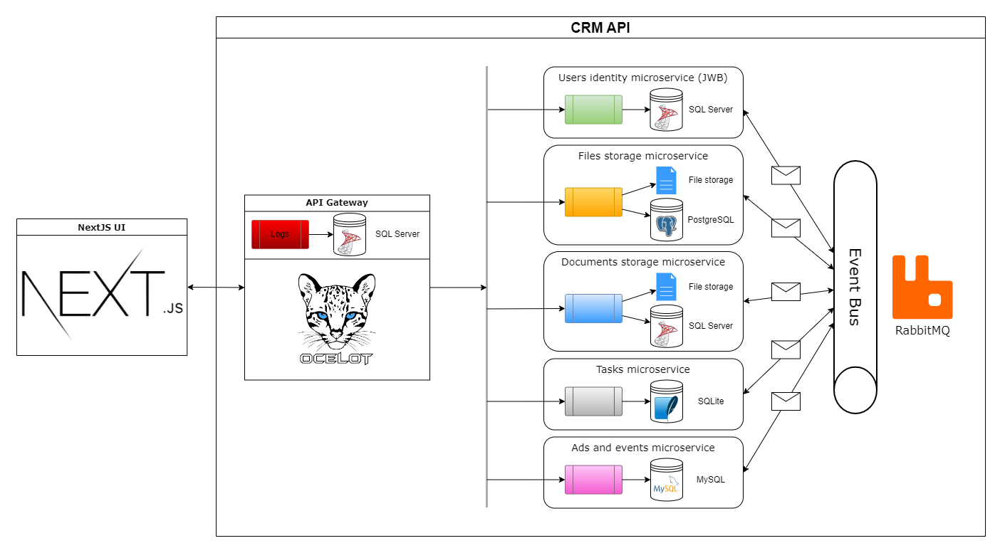
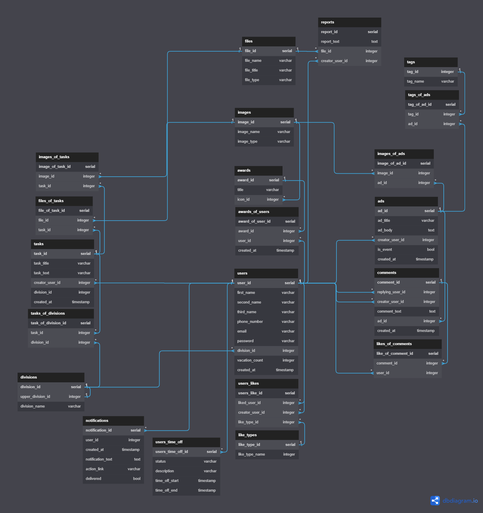

<!-- Ctrl + Shift + V to preview in VSCode -->

<h1 align="center">CMS API</h1>

## Architecture overview

## [ERD](https://dbdiagram.io/d/64970d4102bd1c4a5e01a24c)

Документы - категории документов, их поиск

Plans

- CQRS
- PUT замена, PATCH изменение

<h3>Info</h3>

- [Architecture](https://learn.microsoft.com/ru-ru/dotnet/architecture/microservices/multi-container-microservice-net-applications/implement-api-gateways-with-ocelot)

<h3>Learned<h3>

- [] [Create JWT](https://youtu.be/UwruwHl3BlU)
- [] [Role-Based Auth](https://youtu.be/6sMPvucWNRE)
- [] [Read Claims](https://youtu.be/7vqAHD9DlIA)
- [] [Refresh Tokens](https://youtu.be/_F2hB4cWg-M)
- [] [API Gateway](https://youtu.be/k4l3Ptd4yjw)
- [] [API Gateway JWT](https://youtu.be/P2osfctiHAc)
- [] [Swagger for Ocelot](https://youtu.be/lVeqVZgHEBk)
- [] [Swagger for Ocelot 2](https://youtu.be/7f5tkDW2vZE)
- [] [mcs interaction](https://EDRyoutu.be/ZRLf9YoqgJM)
- [] [Easy interaction](https://youtu.be/b-mT_NO4Kqs)
- [] [RabbitMQ](https://youtube.com/playlist?list=PLCpsrvs6hImZShRjUbqewZWgjJgU6SIvU)

- [] [Sqlite for tasks](https://youtu.be/PDiRDNNc2tw)
- [] [MySQL](https://youtu.be/7rY9vKB_BdA)
- [] [Migrations](https://youtu.be/RB5J9g_bpsI)
- [] [psql code style](https://youtu.be/0-j9yZOged0)
- [] [Mapping](https://youtu.be/hjiVl4IXglE)
- [] [Mapping 2](https://youtu.be/WzECbPsfYOI)
- [] [Serilog to db](https://youtu.be/Nx2lWlmL24s)
- [] [Exceptions](https://youtu.be/-UDFb9e6LOM)
- [] [Optimizate serialize](https://youtu.be/NjXpgko04tU)

- [] [Multiple Databases](https://youtu.be/mOML5Ry-81E)
- [] [Email verify](https://youtu.be/lofj3gUYtaQ)

### Theory

- [Javistka](https://www.youtube.com/@user-lj4jy5pd6m/videos)

Новости/События

- Категории новостей;
- Просмотры, лайки;
- Комменты;
  - лайки коментов;
  - комменты комментов;
  - ответы комментов;

Профиль

- Сведения о работе
- Иерархия должностей
- Информация об отпуске
- Смена пароля
- Типы лайков пользователя (ответственность, безопасность, лидерство, независимость)
- Отсутствие пользователя (показывается дата с какого по какое число и причину отсутствия)

Мессенджер

- создание чатов, групповые чаты (приватные; общие), индивидуальные, уведомления, статус (онлайн, перерыв, не беспокоить, отсутствую)

Сервисы

- Список заданий для подразделения.
- Личный список заданий
- Заказ справок.
- Отчеты.

Общее

- Дни рождения сотрудников с разнообразной фильтрацией с прошедшими и ближайшими датами
- Поиск сотрудников по имени, месту работы
- Список отсутствующих
- Награды
- Вакансии (при клике дополнительная информация о вакансии)

Оповещения

- Ответы на комментарии
- Комментарии к новостям, постам
- Все лайки
- Сообщения

Возможные фичи:

- лента новостей и объявлений
- поиск сотрудников
- рейтинг сотрудников (зависит от выполненных задач и ответов на вопросы)
- вопросы и их поиск
- обсуждение ответов на вопросы, рейтинг ответа
- задачи сотрудникам и их приоритет
- общие и закрытые чаты, личные сообщения с файлами
- тесты и опросники

Для фронта:

- настройка цветовой палитры
- Несколько тем, реализация через переменную чтобы не делать стиль на каждый элемент

Для бэка

- система хранения файлов с папками и сохранением исходных названий
- логирование

---

<h3 align=center>

</h3>
